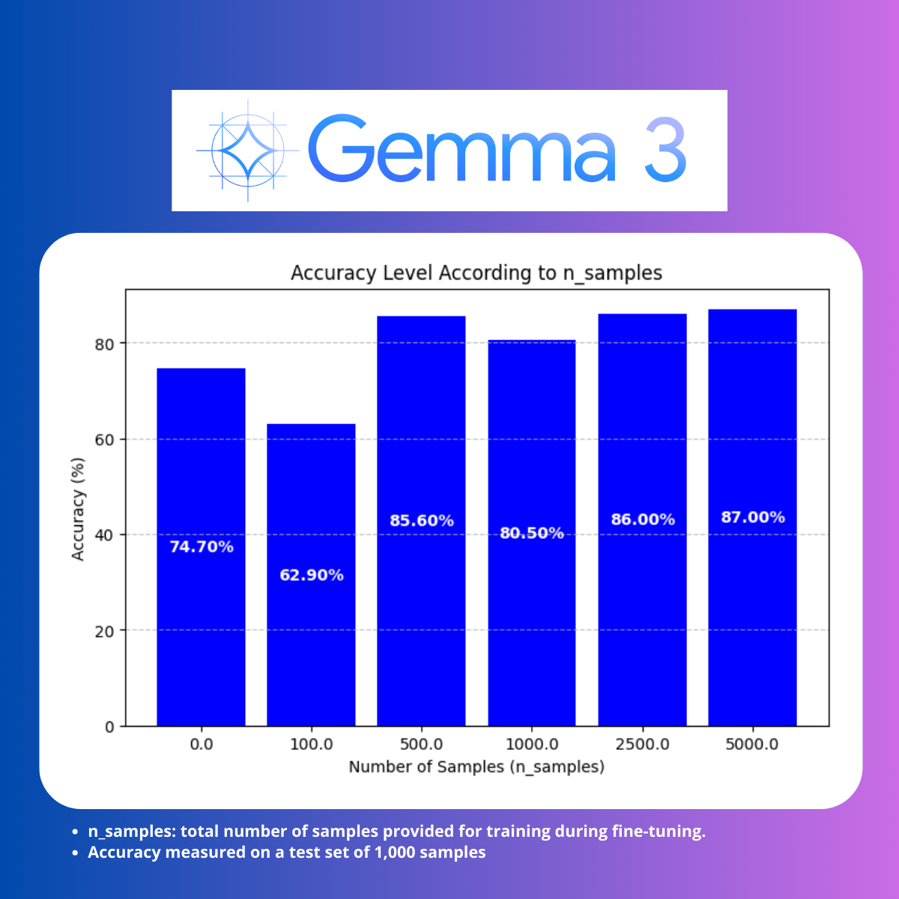

## Project Overview

In this project, I performed fine-tuning on **Gemma 3 1B** using **Culora** for a **sentiment analysis** task. I used the [Twitter US Airline Sentiment dataset](https://www.kaggle.com/datasets/marufnthewindows/twitter-us-airline-sentiment) for training and evaluation.

Below are the results of the fine-tuning process:

Check out the full article at: [medium](https://medium.com/@eduardovalenzuelaparga/tiny-llms-may-be-enough-7f618d8aea04)
